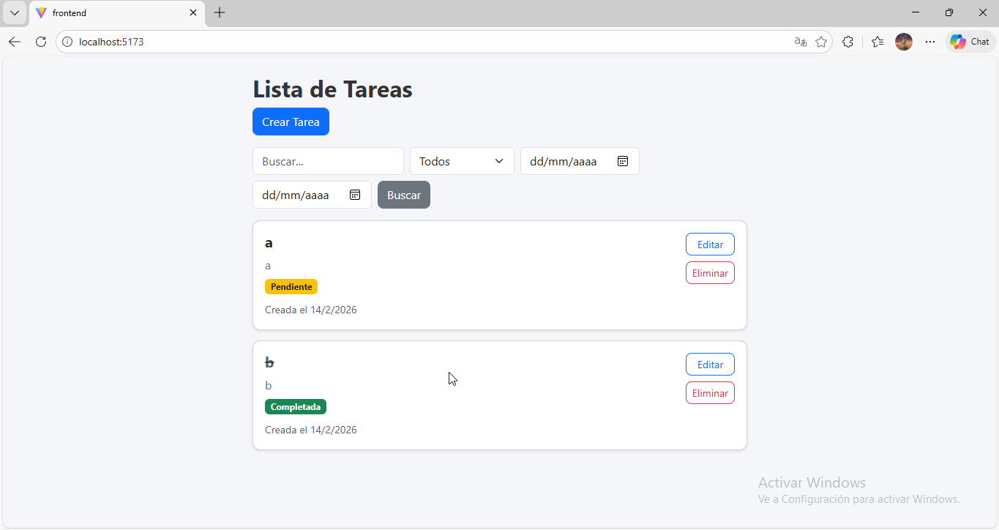
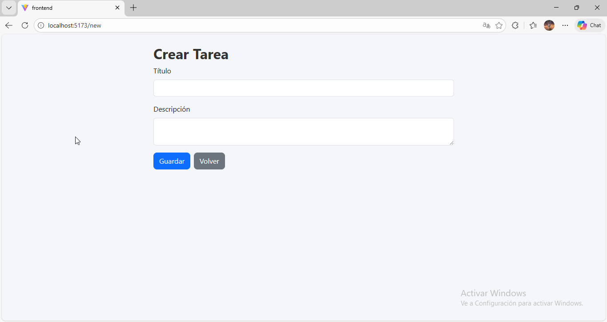

# Task Manager

> Aplicación full-stack de gestión de tareas desarrollada como parte del challenge de ingreso a **Academia ForIT 2026**.

[](https://nodejs.org/)
[](https://reactjs.org/)
[](https://www.typescriptlang.org/)
[](https://expressjs.com/)

---

## Descripción

Task Manager es una aplicación web moderna para la gestión de tareas que demuestra el dominio de tecnologías fundamentales del desarrollo web full-stack. El proyecto incluye un backend RESTful robusto y un frontend interactivo con React y TypeScript.

### Características principales

- **CRUD** de tareas (Crear, Leer, Actualizar, Eliminar)
- **Filtros avanzados**: búsqueda por texto, estado y rango de fechas
- **Doble sistema de persistencia**: SQLite o memoria (configurable)
- **Interfaz moderna** con React, TypeScript y Bootstrap
- **API RESTful** con Express.js
- **CORS** configurado para desarrollo
- **Vite** para desarrollo rápido en frontend

---

## Tecnologías utilizadas

### Backend

- **Node.js** (v18+)
- **Express.js** 5.2 - Framework web
- **SQLite3** - Base de datos (opcional)
- **CORS** - Manejo de políticas de origen cruzado
- **dotenv** - Gestión de variables de entorno
- **Nodemon** - Recarga automática en desarrollo

### Frontend

- **React** 19.2 - Biblioteca de UI
- **TypeScript** 5.9 - Tipado estático
- **Vite** 7.3 - Build tool y dev server
- **React Router DOM** 7.13 - Enrutamiento
- **Bootstrap** 5.3 - Framework CSS
- **ESLint** - Linter de código

---

## Estructura del proyecto

```
ForIT/
├── backend/
│   ├── src/
│   │   ├── app.js              # Punto de entrada de la aplicación
│   │   ├── config/
│   │   │   └── db.js           # Configuración de base de datos
│   │   ├── controllers/
│   │   │   └── taskController.js   # Lógica de negocio
│   │   ├── models/
│   │   │   ├── taskmodel.js        # Modelo con SQLite
│   │   │   └── taskMemoryModel.js  # Modelo en memoria
│   │   └── routes/
│   │       └── taskRoutes.js   # Definición de rutas
│   ├── database/               # Archivos de base de datos
│   └── package.json
│
└── frontend/
    ├── src/
    │   ├── main.tsx            # Punto de entrada
    │   ├── App.tsx             # Componente principal
    │   ├── components/
    │   │   ├── TaskForm.tsx    # Formulario de tareas
    │   │   └── TaskItem.tsx    # Tarjeta de tarea individual
    │   ├── pages/
    │   │   └── TaskList.tsx    # Lista de tareas
    │   ├── types/
    │   │   └── Task.ts         # Tipos TypeScript
    │   └── styles/
    │       └── global.css      # Estilos globales
    ├── public/
    └── package.json
```

---

## Instalación y ejecución

### Requisitos previos

- **Node.js** v18 o superior
- **npm** (incluido con Node.js)
- **Git**

### 1️⃣ Clonar el repositorio

```bash
git clone https://github.com/joaquinyjoa/ForIT.git
cd ForIT
```

### 2️⃣ Configurar y ejecutar el Backend

```bash
# Navegar a la carpeta del backend
cd backend

# Instalar dependencias
npm install

# Crear archivo .env
# En Windows (PowerShell):
echo @"
PORT=3000
NOMBREARCHIVO=tasks.db
USE_MEMORY=false
"@ | Out-File -FilePath .env -Encoding utf8
```

**Configuración de variables de entorno (`.env`):**

```env
PORT=3000                    # Puerto del servidor
NOMBREARCHIVO=tasks.db       # Nombre del archivo SQLite
USE_MEMORY=false            # true: usa memoria | false: usa SQLite
```

**Iniciar el servidor:**

```bash
# Con Nodemon (recarga automática)
npm run dev

# O con Node.js
npm start
```

El backend estará disponible en: **http://localhost:3000**

### 3️⃣ Configurar y ejecutar el Frontend

```bash
# Volver a la raíz y navegar al frontend
cd ../frontend

# Instalar dependencias
npm install

# Crear archivo .env
# En Windows (PowerShell):
echo "VITE_API_URL=http://localhost:3000" | Out-File -FilePath .env -Encoding utf8
```

**Configuración de variables de entorno (`.env`):**

```env
VITE_API_URL=http://localhost:3000
```

**Iniciar la aplicación:**

```bash
npm run dev
```

El frontend estará disponible en: **http://localhost:5173**

---

## 📡 API Endpoints

| Método   | Endpoint     | Descripción                                       |
| -------- | ------------ | ------------------------------------------------- |
| `GET`    | `/tasks`     | Obtener todas las tareas (con filtros opcionales) |
| `GET`    | `/tasks/:id` | Obtener una tarea específica                      |
| `POST`   | `/tasks`     | Crear una nueva tarea                             |
| `PUT`    | `/tasks/:id` | Actualizar una tarea existente                    |
| `DELETE` | `/tasks/:id` | Eliminar una tarea                                |

### Ejemplos de uso

**Crear una tarea:**

```bash
curl -X POST http://localhost:3000/tasks \
  -H "Content-Type: application/json" \
  -d '{"title":"Mi tarea","description":"Descripción de la tarea"}'
```

**Obtener tareas con filtros:**

```bash
# Buscar por texto
GET /tasks?search=comprar

# Filtrar por estado
GET /tasks?completed=true

# Filtrar por rango de fechas
GET /tasks?fromDate=2026-01-01&toDate=2026-12-31
```

---

## Capturas de pantalla

### Lista de tareas



### Crear tarea



### Editar tarea


---

## Scripts disponibles

### Backend

```bash
npm start      # Inicia el servidor
npm run dev    # Inicia con Nodemon (recarga automática)
```

### Frontend

```bash
npm run dev      # Inicia el servidor de desarrollo
npm run build    # Construye la aplicación para producción
npm run preview  # Vista previa de la build de producción
npm run lint     # Ejecuta ESLint
```

---

## Configuración avanzada

### Cambiar entre SQLite y Memoria

En el archivo `.env` del backend, modifica la variable:

```env
# Usar memoria (datos se pierden al reiniciar)
USE_MEMORY=true

# Usar SQLite (persistencia de datos)
USE_MEMORY=false
```

### Cambiar el puerto del backend

Modifica la variable `PORT` en el `.env` del backend y actualiza `VITE_API_URL` en el frontend.

---

## Autor

Desarrollado como parte del challenge de **Academia ForIT 2026**.

Contacto: [GitHub](https://github.com/joaquinyjoa)
gmail: joaquinalfredogreco@gmail.com
